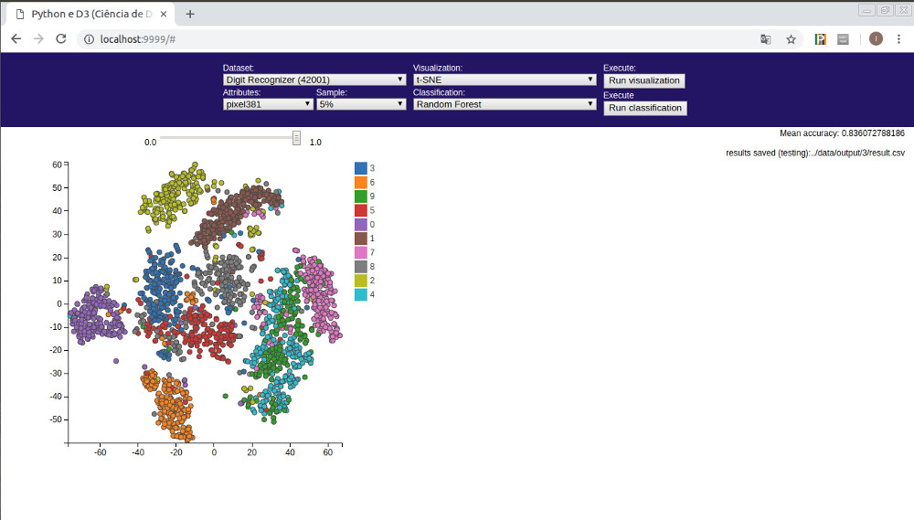

# PDCV

Python ciência de dados e visualização

## Exemplos: Ciência de Dados e Visualização com Python

Disciplina: Visualização

Monitor: Ivar Vargas Belizario

E-mail: ivar@usp.br

## Lista de exemplos:

* Exemplo 1: Forest Cover Type
* Exemplo 2: Costa Rican Household Poverty Level Prediction
* Exemplo 3: Digit Recognizer

## Requerimentos:

- Python >= 2.7
- Numpy
- Pandas
- Scikit-learn
- Tornado
- zip

No Ubuntu Linux instalar os requerimentos executando os seguintes comandos no terminal:

```
sudo apt-get install python
sudo apt-get install python-pip
pip install scikit-learn numpy pandas scikit-learn tornado zip
```

## Descargar o código fonte:

Descarregue o código desde:

```
https://github.com/ivarvb/pcdv
```

Logo descompactar o arquivo descarregado.

## Parte I: Exemplos somente com python

Nesta secção são apresentados exemplos de como empregar python para tarefas de ciência de dados e visualização.

## Execução:

No terminal acessar a cada pasta python/exemplo[x]/src/ e executar o seguinte comando:

```
python app.py
```
	
## Parte II. Exemplos com python e D3.

Nesta secção é apresentada uma aplicação web cliente/servidor baseada em python e D3 para tarefas de ciência de dados e visualização.

## Execução:

Desde o terminal acessar à pasta pythonD3/

Para o servidor executar:

```
sh server.sh
```

O servidor estará pronto com a seguinte mensagem:

```
The server is ready: http://localhost:9999/
```

Para o cliente executar:

```
sh server.sh
```

Ou abrir o web browser com o seguinte endereço:

```
http://localhost:9999/
```

Depois desde o web browser o usuário poderá interagir com a aplicação. Uma ilustração da aplicação pode ser apreciado na seguinte figura:




